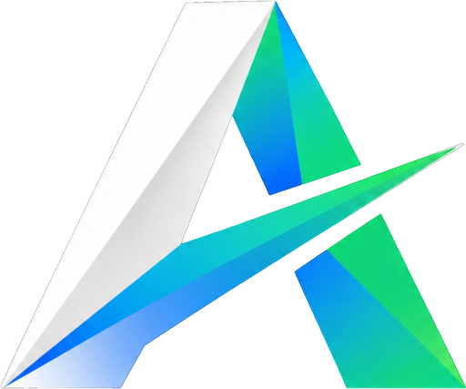
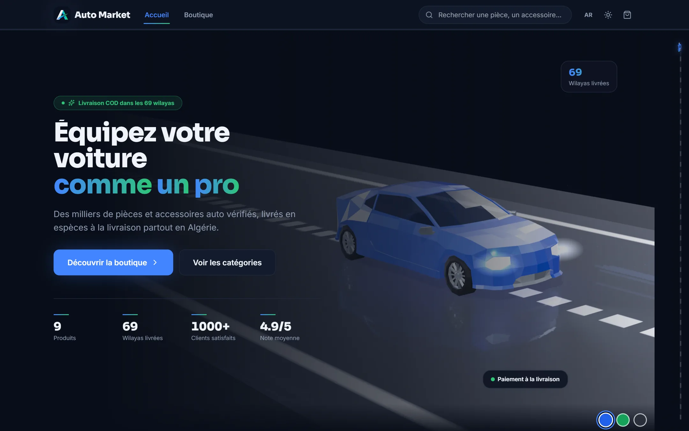
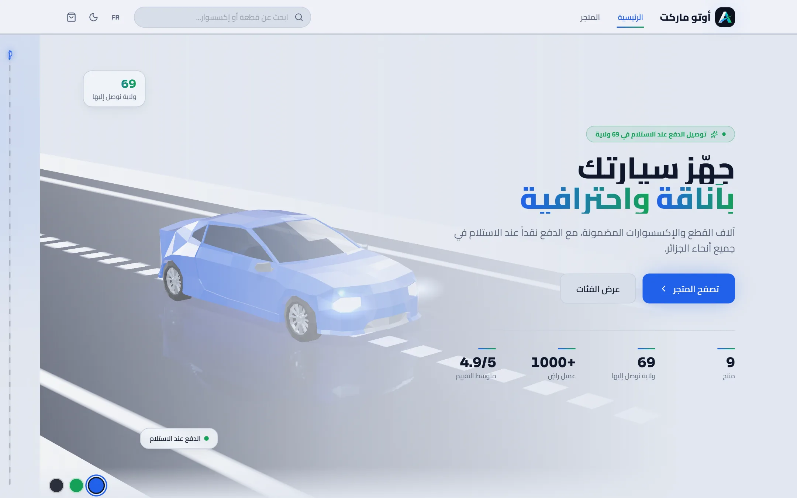
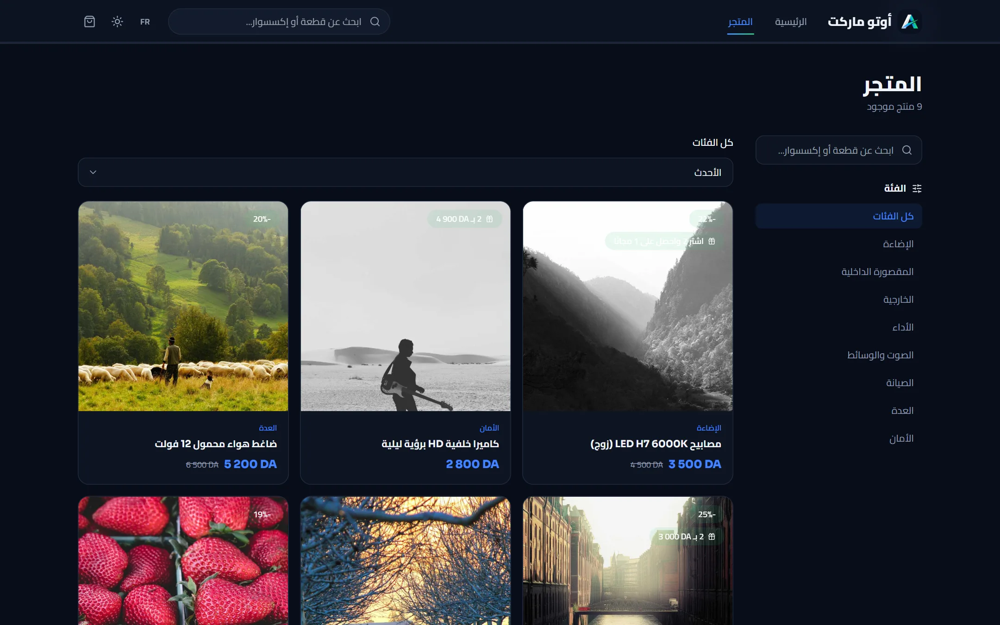
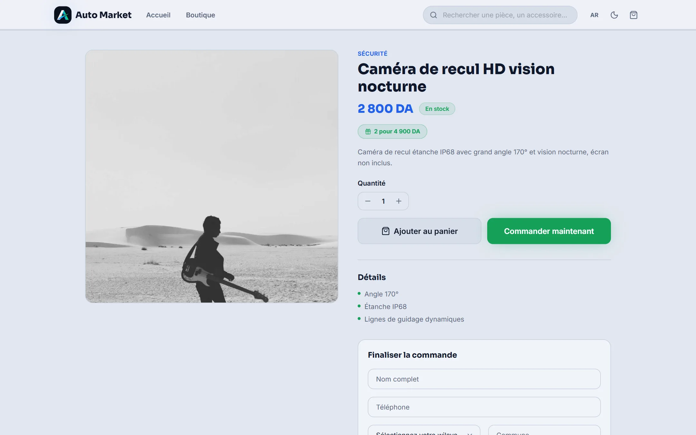
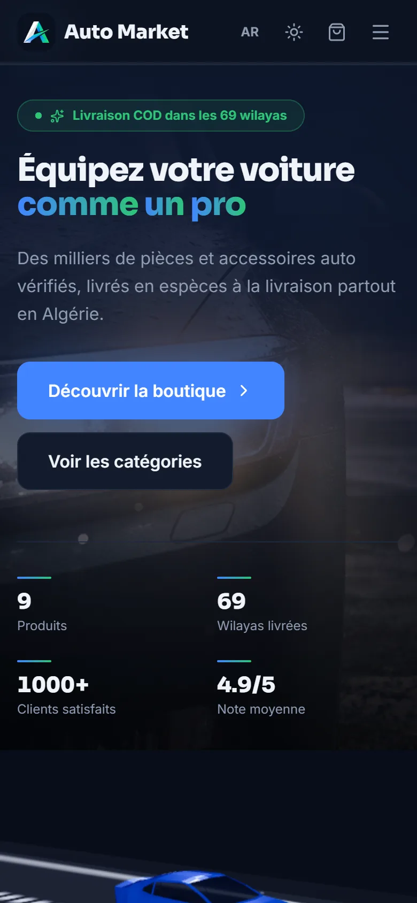
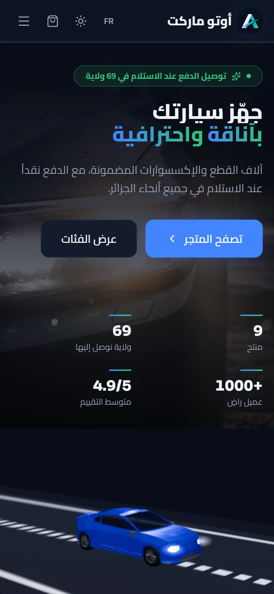
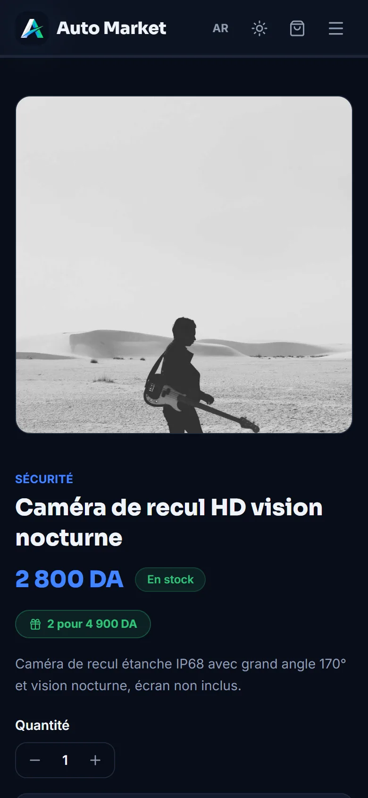

<div align="center">



# Auto Market

**A bilingual, cash-on-delivery e-commerce platform for car parts & accessories in Algeria.**

[**www.auto-market.shop**](https://www.auto-market.shop)


</div>

---

<p align="center">
  
</p>

## Overview

Auto Market is a production storefront and back office built for the Algerian
market, where most online shoppers pay cash when the parcel arrives. The whole
purchase flow is designed around that reality: no account, no card, just a
name, a phone number and a wilaya — and the order is in.

- **Storefront** — landing page, searchable catalogue with category filters and
  sorting, product pages with gallery, video and variants, cart drawer, and a
  one-page checkout that can also be completed inline from the product page.
- **Bilingual, RTL-first** — full Arabic (right-to-left) and French interfaces,
  switchable instantly, with direction and language set before first paint.
- **Delivery for all 69 wilayas** — per-wilaya home and office (stop-desk) delivery prices,
  managed from the dashboard.
- **Promotions engine** — "buy X get Y free" and "X for a fixed price" bundle
  offers, plus compare-at prices, all priced on the server.
- **Admin dashboard** — sales overview, product and category management with
  image/video uploads and variant photos, order pipeline with status tracking
  and automatic restocking on cancellation, delivery-price editor, customer
  reviews, and Excel export of orders.

## Design

The visual concept is **"the open road"**: the site should feel like a
performance car, not a catalogue.

- **Interactive 3D hero** — a real-time three.js sports car drives down a
  stylised road. Shoppers can repaint it with the colour chips, and it falls
  back gracefully to a static image on devices without WebGL.
- **Automotive motion language** — a road-lane scroll-progress rail, speed
  streaks, animated lane dividers with parallax cars, and a tachometer loading
  indicator. All motion respects `prefers-reduced-motion`.
- **Blue / white / green identity** — deep brand blue for trust, green for the
  cash-on-delivery promise, set in Sora, Inter and Cairo so Latin and Arabic
  typography carry the same weight.
- **Dark and light themes** — both are first-class, built on CSS-variable
  design tokens, and remembered between visits.

## Screenshots

### Desktop

<table>
  <tr>
    <td width="50%"></td>
    <td width="50%"></td>
  </tr>
  <tr>
    <td align="center"><sub>Home — Arabic (RTL), light theme</sub></td>
    <td align="center"><sub>Shop — category filters and bundle offers</sub></td>
  </tr>
  <tr>
    <td colspan="2"></td>
  </tr>
  <tr>
    <td colspan="2" align="center"><sub>Product page — bundle offer and inline cash-on-delivery checkout</sub></td>
  </tr>
</table>

### Mobile

<p align="center">
  
  &nbsp;
  
  &nbsp;
  
</p>

## Tech stack

| Layer | Technology |
| --- | --- |
| Framework | React 19, TypeScript (strict), Vite |
| Styling | Tailwind CSS with CSS-variable design tokens |
| 3D & motion | three.js via React Three Fiber + drei, Framer Motion |
| State & data | Zustand (persisted cart), TanStack Query |
| Forms & validation | react-hook-form + zod |
| Backend | Supabase — PostgreSQL, Row Level Security, Auth, Storage, RPC functions |
| Hosting | Vercel (static SPA + Edge Middleware) |
| Tooling | Bun, Biome (lint + format) |

## Security

- **Server-side pricing.** The browser never sends a trusted price. Orders go
  through a single PostgreSQL function (`place_order`) that re-reads every
  product, variant, offer and delivery fee, validates stock and recomputes the
  total inside one transaction.
- **Row Level Security on every table.** Anonymous visitors can only read
  active products, categories, delivery prices and published reviews; orders are
  written exclusively through the RPC and read back only by order number.
- **Anti-abuse on checkout.** Per-phone-number rate limits enforced in the
  database, input shape and length validation server-side, plus a honeypot and
  minimum-fill-time check in the form.
- **Hardened HTTP headers.** HSTS with preload, `X-Content-Type-Options`,
  `X-Frame-Options`, a strict `Referrer-Policy`, a locked-down
  `Permissions-Policy`, and a hash-based Content Security Policy.
- **Safe exports.** Order exports to Excel neutralise formula injection from
  customer-entered text.
- **No secrets in the client.** Only the public anon key ships to the browser;
  admin access is gated by Supabase Auth with public sign-up disabled.

## Performance

- **Route-level code splitting** — only the landing page loads eagerly; shop,
  product, checkout and the entire admin dashboard are lazy-loaded chunks.
- **Stable vendor chunks** — React, motion and data libraries are split so a
  new deploy does not invalidate the framework cache.
- **Lean 3D** — the hero car is a quantised glTF model (~27 KB over the wire),
  loaded only on the page that renders it, without the weight of a Draco
  decoder.
- **Responsive images** — `srcset` sizing via Supabase image transforms,
  client-side compression on upload, and a self-healing fallback.
- **Caching** — immutable, year-long caching for hashed assets and
  stale-while-revalidate for media; the Supabase origin is preconnected.
- **No flash of wrong theme or direction** — theme and language are applied by
  a tiny inline script before the first paint.

## SEO

- **Localised metadata** — per-page titles, descriptions, canonical URLs, Open
  Graph and Twitter cards, with `fr_DZ` / `ar_DZ` locales.
- **Structured data** — `Store` schema site-wide and `Product` + `Offer` schema
  (price, currency, availability) on every product page.
- **Rich link previews** — a Vercel Edge Middleware serves product-specific
  titles, descriptions and images to social crawlers (Facebook, WhatsApp,
  Instagram, X, Telegram…), so shared product links never fall back to a
  generic card.
- **Crawl control** — a sitemap regenerated from live products on every build,
  and a `robots.txt` that keeps checkout and admin out of the index.

## Project structure

```
src/
  components/   layout, product, UI kit, and motion/3D effects
  hooks/        data fetching (TanStack Query), auth, SEO, media queries
  i18n/         Arabic & French translations, RTL-aware language provider
  lib/          Supabase client, order placement, offers, images, formatting
  pages/        storefront pages and the admin dashboard
  store/        persisted cart (Zustand)
  theme/        light / dark theme provider
supabase/
  migrations/   sequential SQL: schema, RLS, RPC functions, storage
middleware.ts   Edge Middleware for social link previews
scripts/        sitemap and Open Graph image generators
```

## Running locally

Requires [Bun](https://bun.sh) and a Supabase project.

```bash
bun install
cp .env.example .env    # add VITE_SUPABASE_URL and VITE_SUPABASE_ANON_KEY
bun run dev
```

Apply the SQL files in `supabase/migrations/` in numeric order, then create the
admin user in Supabase Auth and **disable public sign-ups**.

| Command | Purpose |
| --- | --- |
| `bun run dev` | Start the development server |
| `bun run build` | Type-check, regenerate the sitemap and build for production |
| `bun run typecheck` | Run the TypeScript compiler |
| `bun run lint` | Lint and format-check with Biome |

## Author

Designed and built by **Alaa Younsi** — [@Alaa-Younsi](https://github.com/Alaa-Younsi).

## License

Copyright © 2026 Alaa Younsi. **All rights reserved.**

This repository is published for viewing only. No part of it may be copied,
modified, redistributed or reused without prior written permission. See
[LICENSE](LICENSE) for the full terms.
